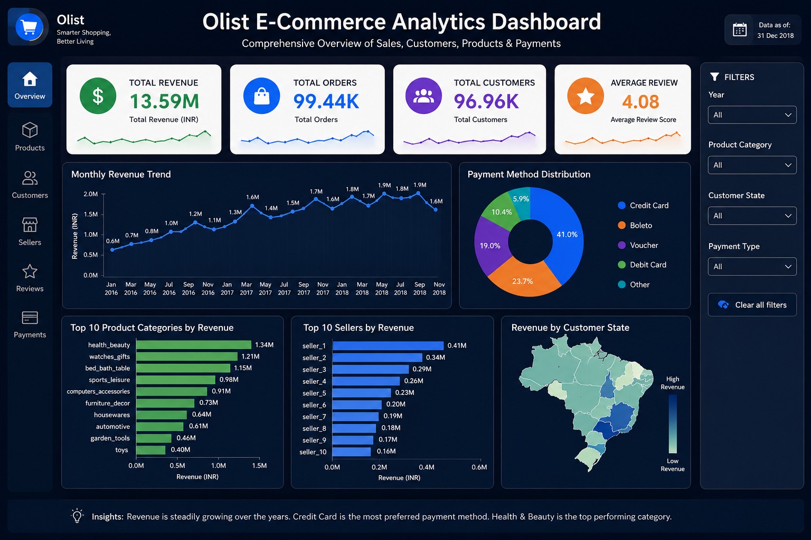

# 🛒 Olist E-Commerce Data Warehouse & Business Intelligence Project

<p align="center">
  
</p>

<p align="center">
  <b>End-to-End Data Engineering Project using Python, PostgreSQL, SQL & Power BI</b>
</p>

---

# 📌 Project Overview

This project demonstrates the complete development of an **End-to-End Data Warehouse** using the **Olist Brazilian E-Commerce Dataset**.

The pipeline starts from raw CSV files, processes the data through ETL and staging layers, builds a dimensional warehouse, and finally delivers interactive business insights through a Power BI dashboard.

---

# 🏗️ Architecture

```text
                +----------------------+
                |   Raw CSV Files      |
                +----------+-----------+
                           |
                           v
                +----------------------+
                |   Python ETL Scripts  |
                +----------+-----------+
                           |
                           v
                +----------------------+
                | PostgreSQL Raw Layer  |
                +----------+-----------+
                           |
                           v
                +----------------------+
                |   Staging Layer       |
                | Data Cleaning & Prep  |
                +----------+-----------+
                           |
                           v
                +----------------------+
                | Warehouse Layer       |
                | Fact & Dimension      |
                +----------+-----------+
                           |
                           v
                +----------------------+
                |  Power BI Dashboard   |
                +----------------------+
```

---

# 🛠️ Tech Stack

| Technology | Purpose |
|------------|---------|
| 🐍 Python | ETL Pipeline |
| 🐼 Pandas | Data Processing |
| 🐘 PostgreSQL | Database & Data Warehouse |
| 📝 SQL | Data Modeling & Transformations |
| 📊 Power BI | Dashboard & Visualization |

---

# 📂 Project Structure

```text
olist_de_project/
│
├── raw_data/
│   ├── customers.csv
│   ├── orders.csv
│   ├── products.csv
│   └── ...
│
├── scripts/
│   ├── etl_load.py
│   └── test_connection.py
│
├── sql/
│   ├── raw_schema.sql
│   ├── staging_layer.sql
│   └── warehouse_layer.sql
│
├── dashboard/
│   └── dashboard.png
│
└── README.md
```

---

# 🗄️ Data Warehouse Design

## Raw Layer
- Stores original CSV data without transformations.
- Preserves source records for auditing and reproducibility.

## Staging Layer
- Cleans and standardizes data.
- Handles duplicates and prepares datasets for modeling.

## Warehouse Layer
Implements a dimensional model using:

### Dimension Tables
- `dim_customers`
- `dim_products`
- `dim_sellers`
- `dim_date`
- `dim_geolocation`

### Fact Tables
- `fact_sales`
- `fact_payments`
- `fact_reviews`

---

# 📊 Dashboard Preview

<p align="center">
  
</p>

---

# 📈 Dashboard Highlights

- 💰 Total Revenue Analysis
- 📦 Total Orders
- 👥 Customer Insights
- ⭐ Review Score Analysis
- 🛍️ Product Category Performance
- 🏪 Seller Performance
- 💳 Payment Method Distribution
- 📅 Monthly Revenue Trends
- 🌎 Revenue by State

---

# 🎯 Key Business Metrics

| Metric | Value |
|---------|-------|
| 💰 Total Revenue | **₹13.59M** |
| 📦 Total Orders | **99.44K** |
| 👥 Total Customers | **96.96K** |
| ⭐ Average Review Score | **4.08** |

---

# 🚀 ETL Workflow

```text
CSV Files
     │
     ▼
Python ETL
     │
     ▼
PostgreSQL Raw Layer
     │
     ▼
Staging Layer
     │
     ▼
Warehouse Layer
     │
     ▼
Power BI Dashboard
```

---

# 💡 Skills Demonstrated

- ✅ Data Engineering
- ✅ ETL Pipeline Development
- ✅ PostgreSQL Database Design
- ✅ SQL Data Modeling
- ✅ Data Cleaning & Transformation
- ✅ Star Schema Implementation
- ✅ Fact & Dimension Modeling
- ✅ Business Intelligence
- ✅ Power BI Dashboard Development

---

# 👨‍💻 Author

## **Bhuvnesh Lodha**

Aspiring **Data Engineer** passionate about building scalable data pipelines, designing data warehouses, and creating insightful analytics dashboards.

---

# ⭐ If you found this project useful

Consider giving it a **star ⭐** on GitHub!
